# Лабораторная работа №3

# Что такое STP?
**Spanning-Tree_Protocol** - Протокол покрывающего (или остовного) дерева 

`Остовное дерево - структура без петель`

Это протокол в сетях, который убирает **петли (loops)** между коммутаторами, чтобы сеть не «сходила с ума» 

Если у нас несколько коммутаторов соединены с *запасными (резервными)* линиями - это хорошо *(есть отказоустойчивость)*, но появляется проблема:

- кадры начинают бесконечно ходить по кругу
- возникает broadcast storm (шторм широковещаний)
- сеть «умирает»

STP не удаляет кабели, а просто: `логически отключает лишние порты, чтобы не было циклов`

## 1. Важный шаг - Выбор Root Bridge (главного коммутатора)
Побеждает тот, у кого самый маленький **Bridge ID**
- (приоритет + MAC)

Раньше в сетях использовали устройства под названием bridge (мосты)

Они:
- соединяли сегменты сети
- работали по MAC-адресам (как современные свитчи)
Потом появились switches, по по сути это многопортовые bridge

## 2. Поиск кратчайших путей
Каждый свитч считает:
как быстрее добраться до Root
Используется метрика:
    • cost (стоимость пути, зависит от скорости линка)

## 3. Выбор ролей портов
Каждый порт получает роль:
- Root Port (RP) — лучший путь к root
- Designated Port (DP) — главный на сегменте
- Alternate  Port — блокируется (чтобы не было петли), он резервный 


На одном соединении:

с одной стороны: **Designated Port**

с другой: либо **Root Port, либо Blocked**

### Root Port (RP)

есть у каждого свитча (кроме root),один единственный, ведёт к Root Bridge,всегда Forwarding.

 это:
>“мой лучший путь к главному свитчу”

**Root Port** = `конкретный` интерфейс на свитче.

### Designated Port (DP) 
выбирается на каждом сегменте (линии), может быть много в сети, отвечает за передачу трафика, всегда **Forwarding**

>“главный порт на этом участке сети”


### По итогу имеем:
- остается только одна логическая “ветка” (дерево)
- лишние пути выключены (blocked)
- но физически кабели остаются (резерв на случай отказа)

### Если что-то ломается, линк или свитч упал
#### STP автоматически:
- пересчитывает топологию
- разблокирует запасной путь

 **ICMP** (Internet Control Message Protocol) — это
служебный протокол для диагностики и сообщений об ошибках в сети

это служебное сообщение, которое передаётся внутри IP


**Содержит**: тип (Type),код (Code),данные

Самый известный пример — **ping**

ICMP не отправляется сам по себе,
а упаковывается внутрь **IP-пакета**

- Ethernet (кадр)

    - IP пакет

        - ICMP сообщение

**Интерфейс** в Cisco Packet Tracer — это, по сути, порт устройства (роутера или коммутатора), через который оно подключается к сети.
>интерфейс = точка подключения к сети

<br>

---

<br>

# Протокол агрегирования каналов EtherChannel 
EtherChannel — это технология, которая позволяет объединить **несколько физических линков** (кабелей) в **один** логический канал.


Вместо одного кабеля между свитчами:
- делаем 2–8 кабелей
- объединяем их
- получаем один **"супер-линк"**

## Зачем нужен EtherChannel

1. Больше скорость (например: 4 × 1 Gbps = до 4 Gbps)

2. Отказоустойчивость (один кабель упал — всё работает)

3. Нет блокировки STP
(STP видит это как один линк, а не несколько)

### Как это работает

- создаётся Port-Channel (Po1, Po2…)

- несколько портов объединяются в группу

- трафик распределяется (load balancing)

## Протоколы EtherChannel

1.  **PAgP** (Port Aggregation Protocol)

- разработан Cisco

- работает только на Cisco

Режимы:

`auto` - пассивный

`desirable` - активный

 Обычно:

на одном свитче → desirable

2. **LACP** (Link Aggregation Control Protocol)

- **стандарт IEEE (802.3ad)**

### Режимы:

`active`

`passive`

Чтобы EtherChannel работал необходимо обеспечить:

- одинаковую скорость портов

- одинаковый duplex

- одинаковый VLAN / trunk

- одинаковые настройки


### **Аггрегация** 

**Агрегация** — это объединение нескольких элементов в один, чтобы получить лучший результат.

**Агрегация каналов** = объединение нескольких кабелей в один логический канал

Пример:

- было: 1 кабель = 1 Gbps

- стало: 4 кабеля → как будто 1 канал на 4 Gbps

# Задание 1: построение топологической сети как на рисунке 3
Выполнили в ходе выполнения лабораторной работы №2
<br>

# Задание 2: Информация о коммутаторах

### Switch 0
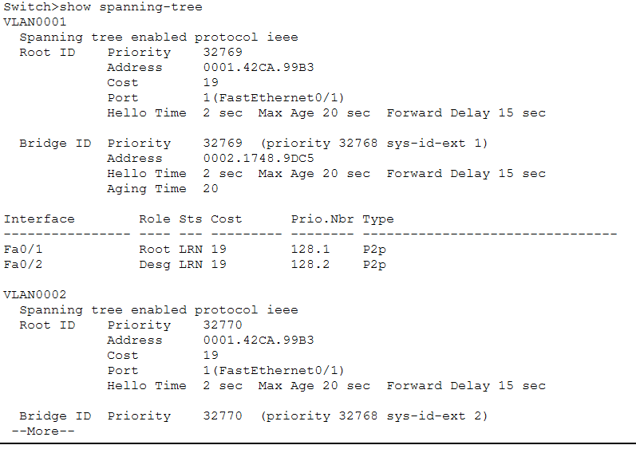

### Switch 1 - root коммутатор
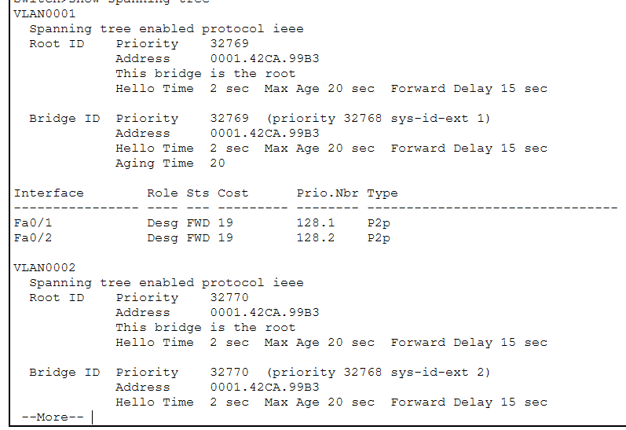

### Switch 2
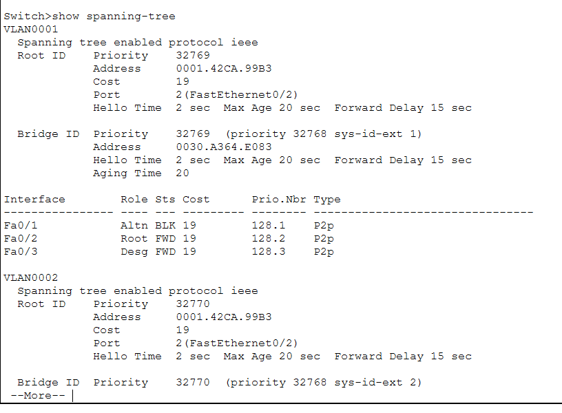

### Vlan-s 1-2-3

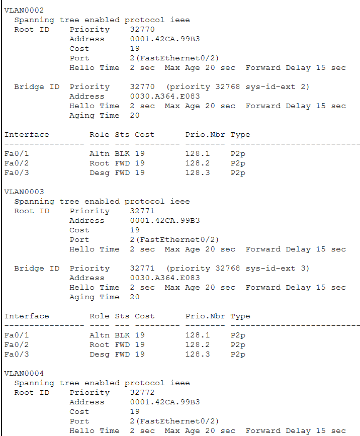

Поскольку приоритет у всех коммутаторов одинаковый **(32769)**, сравниваются MAC-адреса. Наименьший MAC-адрес — `0001.42CA.99B3`, поэтому Switch1 становится **Root Bridge** для VLAN 31, 32 и 33.
Bridge Priority одинаковая для всех VLAN, поэтому STP выбирает один и тот же **Root Bridge**

корневой коммутатор 
Один и тот же для всех VLAN, потому что у него наименьший Bridge ID (приоритет + MAC), а настройки STP одинаковы для всех VLAN.

## Пути движения пакетов ICMP через simulation:

pc6->switch0->switch1->switch2->router->server
server->router->switch2->switch1->switch0->pc6

pc10->switch1->switch2-router->server
server->router->switch2->switch1->pc10


# Задание 3

## Делаем из switch0 rootкоммутатор для vlanов

Чтобы сделать коммутатор root , можно использовать команды 
### switch 0:
```cpp
spanning-tree vlan 31 root primary
spanning-tree vlan 33 root primary
```

или 

```js
spanning-tree vlan 31 priority 4096
spanning-tree vlan 33 priority 4096
```

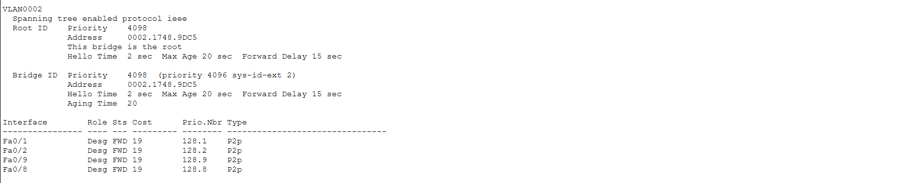

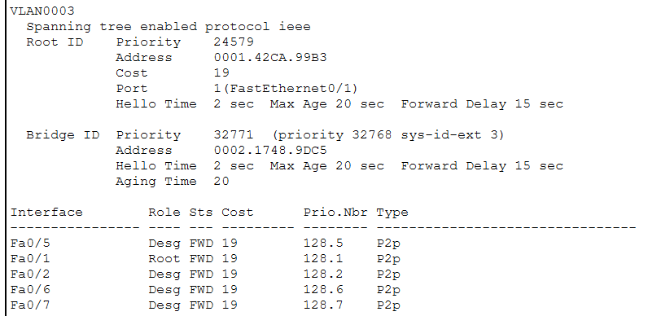

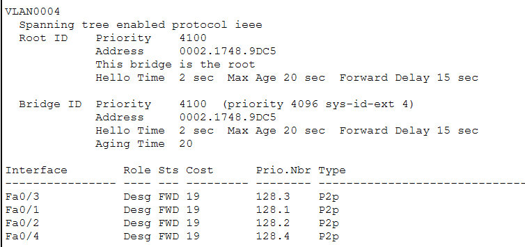

### Switch 1:
```
spanning-tree vlan 32 root primary
```

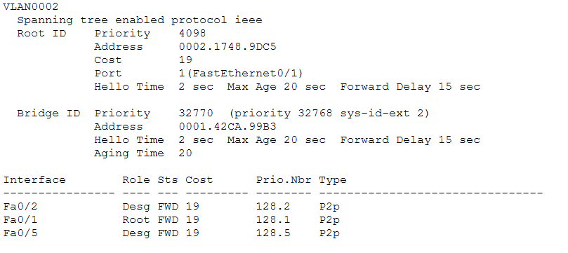

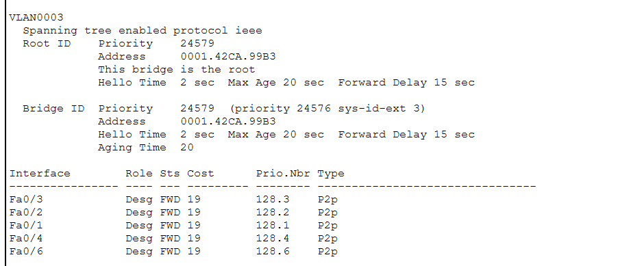

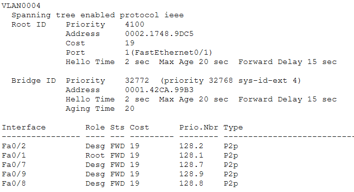


### Switch 2:

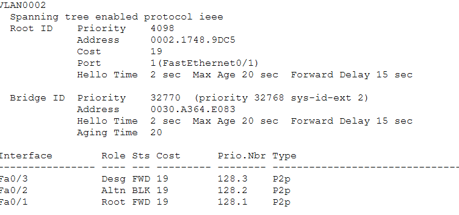

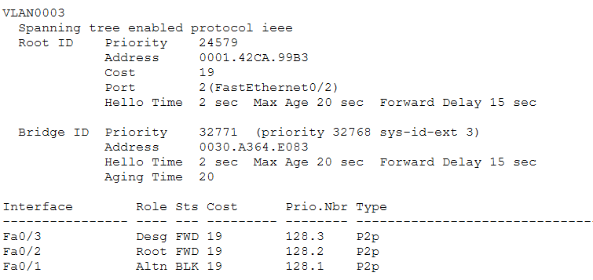

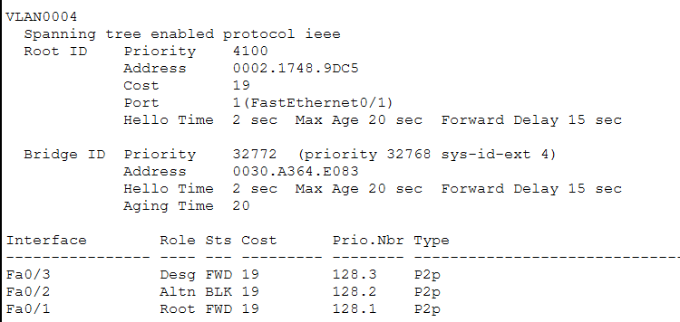

### После изменения root-ов

pc6->switch0->switch1->switch2->router->server
server->router->switch2>switch1->switch0->pc6

pc10->switch1->switch2->router->server
server->router->switch2-switch1->pc10

pc7->switch1->switch1->switch2->router->server
server->router->switch2->switch0->switch1->pc7

***если не задать root коммутатор pc7 будет идти по пути без switch0***


# Задание 4
## Построить логическую топологию сети, показанную на рисунке 34
### Настроить Etherchannel 2-го уровня на свитчах сети, в тех местах где имеем индексы port-channel 1, …, port-channel 9. 

#### Для настройки Etherchannel применим протокол PAgP.

switch 0:

```cpp
Switch(config)#int range fa 0/3, fa 0/4
Switch(config-if-range)#channel-group 1 mode desirable
% Был создан интерфейс порт-канал Port-channel 1
exit
Switch(config)#int port-channel 1
Switch(config-if)#switchport mode trunk

```

```cpp
Switch(config)#int range gig 1/0/3-4
Switch(config-if-range)#channel-group 1 mode auto
% Был создан интерфейс порт-канал Port-channel 1
exit
Switch(config)#int port-channel 1
Switch(config-if)#switchport mode trunk


```


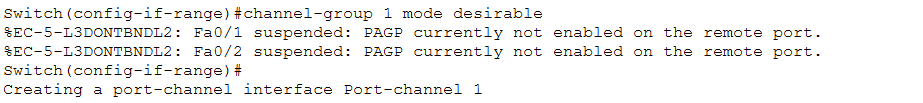
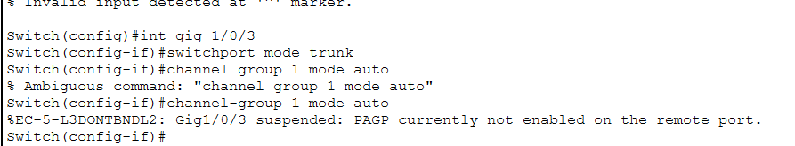

```
show etherchannel summary
```
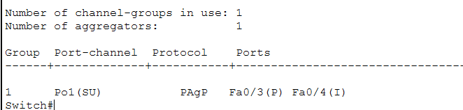

Повторяем процедуру для port-channel 1-9
Например Для switch 3:
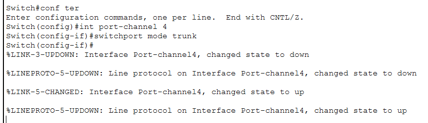

хороший сигнал - исчезла оранжевая точка (она возникает, потому что STP отключает порт для предотвращения петель)

## Настройка коммутаторов L3 cсоседей

На современных коммутаторах Cisco, особенно на моделях Catalyst 2960 и выше, интерфейсы GigabitEthernet поддерживают только dot1q и не имеют выбора между ISL и dot1q.

Поэтому команда switchport trunk encapsulation dot1q недоступна и выдаёт ошибку.
В таких коммутаторах просто делаем:

```
switchport mode trunk
```
- это автоматически использует dot1q.

# МОЙ РЕЗУЛЬТАТ после выполнения 4 задания.
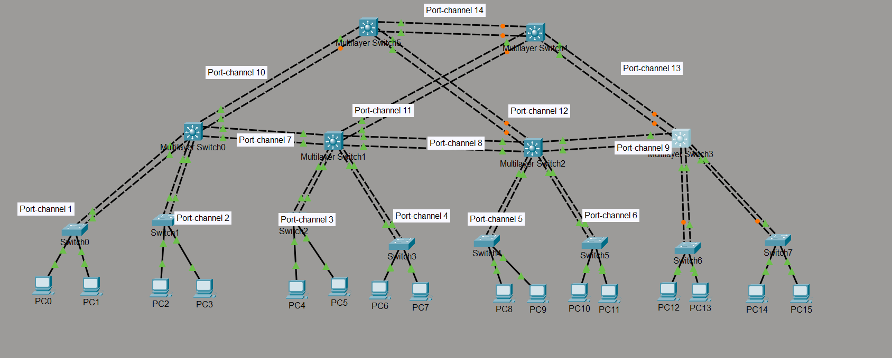

#### Почему между парами свитчей 2-го и 3-го уровня в правой части конфигурации отключены некоторые порты?
потому что эти порты работают через протокол STP, который отключает (блокирует) порты чтобы исбежать петель. Они начнут свою работу если другой порт перестанет работать.

# Задание 5

## Пример конфигурирования для Port-channel 14 второй коммутатор layer 3
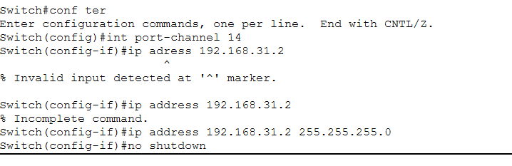
### первый коммутатор
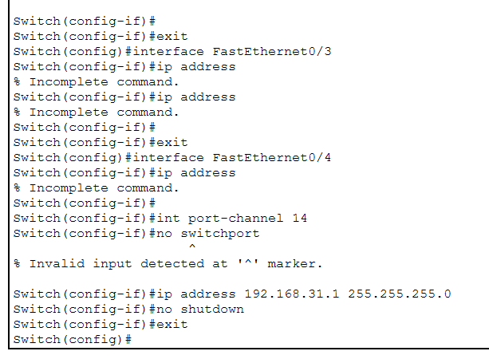

## Упс . ошибочка айпи - 192.168.35.1 и 192.168.35.2

```js
Switch(config-if)#ip address 192.168.35.2 255.255.255.0
```

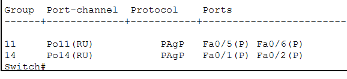

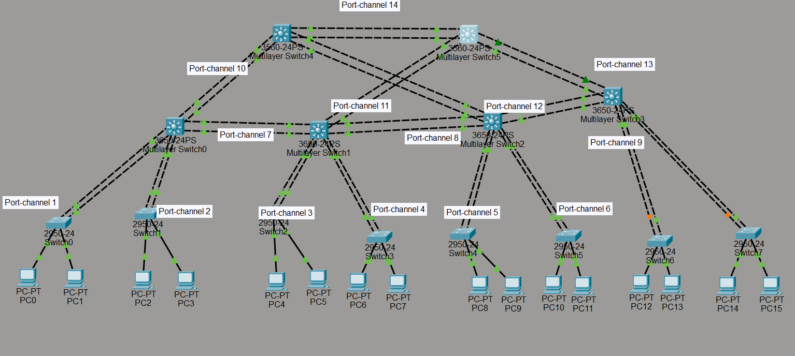

# Вывод:
На этой лабораторной работе я настроил коммутаторы с использованием STP для предотвращения петель в сети, а также объедил порты в EtherChannel как на L2, так и на L3. Для L2 EtherChannel объединялись физические порты в один логический канал с использованием PAgP, обеспечивая агрегирование пропускной способности и отказоустойчивость без назначения IP. Для L3 EtherChannel физические порты переводились в Layer 3, объединялись в логический интерфейс Port-Channel, которому назначались IP-адреса для маршрутизации между коммутаторами. Настройка позволила стабилизировать сеть, повысить её пропускную способность и исключить конфликты адресов.